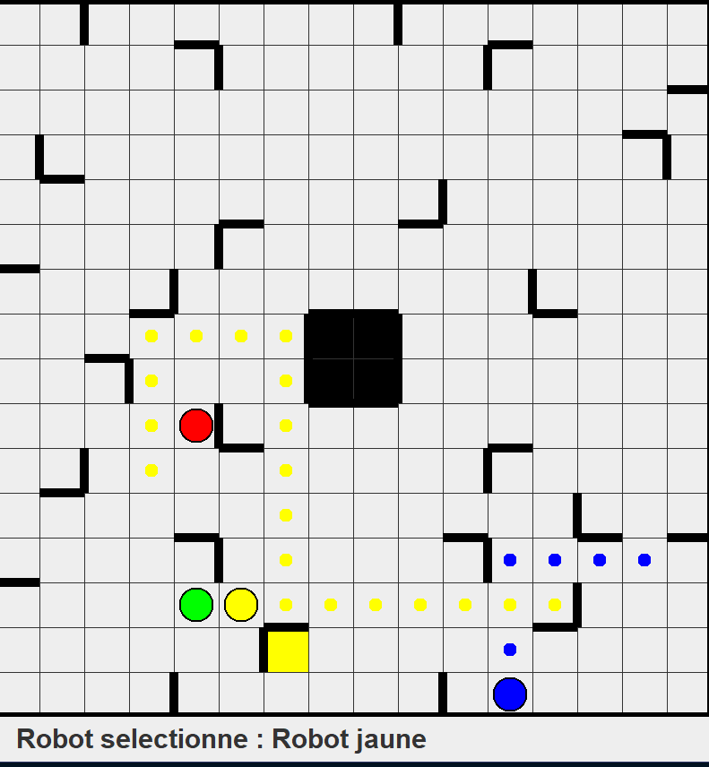

# RicochetRobotGame

1. [Presentation](#presentation-)
2. [Authors](#authors-)
3. [How to use](#how-to-use-)
4. [How to play](#how-to-play-)
5. [Details](#details-)
6. [Links](#links-)

## Authors :

- Durand Enzo 21510242
- Hugo Tiem 21810620

## Presentation :

Ricochet Robot clone, with a GUI, MVC architecture and a solver. 
2nd year BSC degree in computer science, mark : 19.31/20.

## How to use :

- Execute : ``java -jar dist/RicochetRobot.jar``

## How to play :

- select a robot : "R", "G", "B", "J"
- make a move : up/down/left/right arrows
- resolve : "S"
- new game : "Enter"

## Details :

- Implementation of MVC
- Implementation of A*
- Implementation of DFS

## Links :

- https://en.wikipedia.org/wiki/Ricochet_Robot
- https://en.wikipedia.org/wiki/Model%E2%80%93view%E2%80%93controller
- https://en.wikipedia.org/wiki/A*_search_algorithm
- https://en.wikipedia.org/wiki/Depth-first_search
